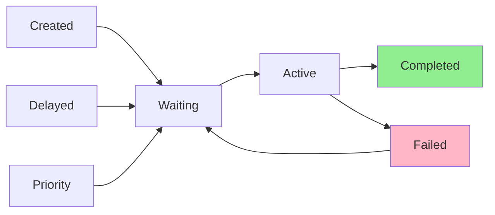
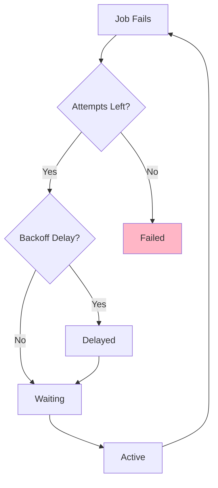

## Overview

Jobs in Bull transition through a series of states from creation to completion. Understanding this lifecycle is crucial for building reliable queue-based systems.

## State Flow

The basic job lifecycle follows this progression:



### State Descriptions

<Steps>
  <Step title="Created">
    Job is instantiated but not yet added to Redis
  </Step>
  
  <Step title="Waiting">
    Job is in the queue, ready to be picked up by a worker
  </Step>
  
  <Step title="Active">
    Job is currently being processed by a worker
  </Step>
  
  <Step title="Completed">
    Job finished successfully
  </Step>
  
  <Step title="Failed">
    Job failed after all retry attempts
  </Step>
</Steps>

## Internal Data Structures

From the source (`~/workspace/source/lib/queue.js:27-42`), Bull manages job states using six Redis data structures:

```javascript
/**
  The Queue keeps 6 data structures:
    - wait (list)
    - active (list)
    - delayed (zset)
    - priority (zset)
    - completed (zset)
    - failed (zset)

        --> priorities      -- > completed
       /     |            /
    job -> wait -> active
       \     ^            \
        v    |             -- > failed
        delayed
*/
```

<Tabs>
  <Tab title="wait">
    FIFO list of jobs ready to be processed
  </Tab>
  <Tab title="active">
    List of jobs currently being processed with locks
  </Tab>
  <Tab title="delayed">
    Sorted set of jobs scheduled for future processing (by timestamp)
  </Tab>
  <Tab title="priority">
    Sorted set of jobs with priority values
  </Tab>
  <Tab title="completed">
    Sorted set of successfully finished jobs
  </Tab>
  <Tab title="failed">
    Sorted set of jobs that exhausted all retry attempts
  </Tab>
</Tabs>

## Complete Lifecycle Example

```javascript
const Queue = require('bull');
const queue = new Queue('lifecycle-demo');

// Monitor all state transitions
queue.on('waiting', (jobId) => {
  console.log(`Job ${jobId} is waiting`);
});

queue.on('active', (job) => {
  console.log(`Job ${job.id} is now active`);
});

queue.on('progress', (job, progress) => {
  console.log(`Job ${job.id} is ${progress}% complete`);
});

queue.on('completed', (job, result) => {
  console.log(`Job ${job.id} completed with result:`, result);
});

queue.on('failed', (job, err) => {
  console.log(`Job ${job.id} failed:`, err.message);
});

// Define processor
queue.process(async (job) => {
  // Job enters 'active' state here
  await job.progress(0);
  
  await performWork();
  await job.progress(50);
  
  await performMoreWork();
  await job.progress(100);
  
  // Job moves to 'completed' state after return
  return { success: true };
});

// Create and add job
const job = await queue.add({ data: 'example' });
// Job immediately enters 'waiting' state
```

## Delayed Jobs Mechanism

Delayed jobs are stored separately and moved to the waiting queue when their delay expires.

### How Delayed Jobs Work

From the source (`~/workspace/source/lib/queue.js:46-54`):

```javascript
/**
  Delayed jobs are jobs that cannot be executed until a certain time in
  ms has passed since they were added to the queue.
  The mechanism is simple, a delayedTimestamp variable holds the next
  known timestamp that is on the delayed set (or MAX_TIMEOUT_MS if none).

  When the current job has finalized the variable is checked, if
  no delayed job has to be executed yet a setTimeout is set so that a
  delayed job is processed after timing out.
*/
```

### Creating Delayed Jobs

```javascript
// Delay by milliseconds
await queue.add(
  { task: 'send-reminder' },
  { delay: 60000 } // Process after 60 seconds
);

// Delay until specific time
const futureDate = new Date('2026-12-25T00:00:00Z');
await queue.add(
  { task: 'holiday-greeting' },
  { delay: futureDate.getTime() - Date.now() }
);
```

### Delayed Job Timer

The queue maintains an internal timer that checks for due delayed jobs:

From the source (`~/workspace/source/lib/queue.js:991-1040`):

```javascript
Queue.prototype.updateDelayTimer = function() {
  if (this.closing) {
    return Promise.resolve();
  }

  return scripts
    .updateDelaySet(this, Date.now())
    .then(nextTimestamp => {
      this.delayedTimestamp = nextTimestamp
        ? nextTimestamp / 4096
        : Number.MAX_VALUE;

      // Clear any existing update delay timer
      if (this.delayTimer) {
        clearTimeout(this.delayTimer);
      }

      // Delay for the next update of delay set
      const delay = _.min([
        this.delayedTimestamp - Date.now(),
        this.settings.guardInterval
      ]);

      // Schedule next processing of the delayed jobs
      if (delay <= 0) {
        // Next set of jobs are due right now, process them also
        this.updateDelayTimer();
      } else {
        // Update the delay set when the next job is due
        // or the next guard time
        this.delayTimer = setTimeout(() => this.updateDelayTimer(), delay);
      }

      return null;
    });
};
```

### Promoting Delayed Jobs

Move a delayed job to the waiting queue immediately:

```javascript
const job = await queue.add({ task: 'data' }, { delay: 3600000 });

// Later, promote to process immediately
await job.promote();
```

## Priority Handling

Jobs with priority values are processed before regular jobs.

### Priority Values

- Lower numbers = higher priority
- Range: 1 (highest) to MAX_INT (lowest)
- Jobs without priority default to processing in FIFO order

### Creating Priority Jobs

```javascript
// High priority - processes first
await queue.add(
  { type: 'urgent-alert' },
  { priority: 1 }
);

// Normal priority
await queue.add(
  { type: 'regular-task' },
  { priority: 5 }
);

// Low priority - processes last
await queue.add(
  { type: 'background-cleanup' },
  { priority: 10 }
);
```

### Priority Processing Order

When a worker requests the next job:

1. Check priority queue for highest priority job
2. If no priority jobs, take from standard waiting queue (FIFO)
3. Process the selected job

<Note>
  Using priorities has a slight performance impact. Only use them when necessary.
</Note>

## Job Retry Flow

When a job fails, it may be retried based on its configuration.

From the source (`~/workspace/source/lib/job.js:285-347`):

```javascript
Job.prototype.moveToFailed = async function(err, ignoreLock) {
  err = err || { message: 'Unknown reason' };
  this.failedReason = err.message;

  await this.queue.isReady();

  let command;
  const multi = this.queue.client.multi();
  this._saveAttempt(multi, err);

  // Check if an automatic retry should be performed
  let moveToFailed = false;
  if (this.attemptsMade < this.opts.attempts && !this._discarded) {
    // Check if backoff is needed
    const delay = await backoffs.calculate(
      this.opts.backoff,
      this.attemptsMade,
      this.queue.settings.backoffStrategies,
      err,
      _.get(this, 'opts.backoff.options', null)
    );

    if (delay === -1) {
      // If delay is -1, we should no continue retrying
      moveToFailed = true;
    } else if (delay) {
      // If so, move to delayed (need to unlock job in this case!)
      const args = scripts.moveToDelayedArgs(
        this.queue,
        this.id,
        Date.now() + delay,
        ignoreLock
      );
      multi.moveToDelayed(args);
      command = 'delayed';
    } else {
      // If not, retry immediately
      multi.retryJob(scripts.retryJobArgs(this, ignoreLock));
      command = 'retry';
    }
  } else {
    // If not, move to failed
    moveToFailed = true;
  }

  if (moveToFailed) {
    this.finishedOn = Date.now();
    const args = scripts.moveToFailedArgs(
      this,
      err.message,
      this.opts.removeOnFail,
      ignoreLock
    );
    multi.moveToFinished(args);
    command = 'failed';
  }
  const results = await multi.exec();
  const code = _.last(results)[1];
  if (code < 0) {
    throw scripts.finishedErrors(code, this.id, command, 'active');
  }
};
```

### Retry States Flow



### Retry Configuration

```javascript
await queue.add(
  { task: 'unstable-api-call' },
  {
    attempts: 3,
    backoff: {
      type: 'exponential',
      delay: 2000  // Start at 2 seconds
    }
  }
);

// Retry attempts:
// 1st failure: wait 2 seconds
// 2nd failure: wait 4 seconds
// 3rd failure: move to failed
```

### Manual Retry

Retry a failed job programmatically:

```javascript
queue.on('failed', async (job, err) => {
  console.log(`Job ${job.id} failed:`, err.message);
  
  // Retry under certain conditions
  if (err.message.includes('temporary')) {
    await job.retry();
  }
});
```

## Stalled Jobs

Jobs can become stalled when a worker crashes or the event loop is blocked.

### What Causes Stalled Jobs

1. **Process crashes**: Worker terminates unexpectedly during processing
2. **Blocked event loop**: CPU-intensive code prevents lock renewal
3. **Network issues**: Redis connection problems prevent lock extension

### Stalled Job Recovery

From the source (`~/workspace/source/lib/queue.js:1042-1086`):

```javascript
/**
 * Process jobs that have been added to the active list but are not being
 * processed properly. This can happen due to a process crash in the middle
 * of processing a job, leaving it in 'active' but without a job lock.
 */
Queue.prototype.moveUnlockedJobsToWait = function() {
  if (this.closing) {
    return Promise.resolve();
  }

  return scripts
    .moveUnlockedJobsToWait(this)
    .then(([failed, stalled]) => {
      const handleFailedJobs = failed.map(jobId => {
        return this.getJobFromId(jobId).then(job => {
          utils.emitSafe(
            this,
            'failed',
            job,
            new Error('job stalled more than allowable limit'),
            'active'
          );
          return null;
        });
      });
      const handleStalledJobs = stalled.map(jobId => {
        return this.getJobFromId(jobId).then(job => {
          if (job !== null) {
            utils.emitSafe(this, 'stalled', job);
          }
          return null;
        });
      });
      return Promise.all(handleFailedJobs.concat(handleStalledJobs));
    });
};
```

### Stalled Job Configuration

```javascript
const queue = new Queue('myqueue', {
  settings: {
    stalledInterval: 30000,  // Check every 30 seconds
    maxStalledCount: 1       // Max 1 recovery attempt
  }
});

queue.on('stalled', (job) => {
  console.log(`Job ${job.id} stalled and will be reprocessed`);
});
```

<Warning>
  **Always monitor stalled jobs in production!** Frequent stalls indicate processor problems and can cause duplicate processing. Jobs that exceed `maxStalledCount` are permanently failed.
</Warning>

## Lifecycle Best Practices

### 1. Monitor All States

```javascript
const states = ['waiting', 'active', 'completed', 'failed', 'stalled', 'delayed'];
states.forEach(state => {
  queue.on(state === 'waiting' ? state : state, (...args) => {
    logger.info(`State: ${state}`, args);
  });
});
```

### 2. Clean Up Finished Jobs

```javascript
await queue.add(
  { data: 'example' },
  {
    removeOnComplete: 100,  // Keep last 100
    removeOnFail: 50        // Keep last 50 failures
  }
);

// Or periodically clean
setInterval(() => {
  queue.clean(24 * 3600 * 1000, 'completed'); // Remove after 24 hours
  queue.clean(7 * 24 * 3600 * 1000, 'failed'); // Remove after 7 days
}, 3600000);
```

### 3. Handle Job Completion

```javascript
const job = await queue.add({ data: 'value' });

// Wait for completion
try {
  const result = await job.finished();
  console.log('Job succeeded:', result);
} catch (error) {
  console.log('Job failed:', error.message);
}
```

### 4. Graceful Transitions

```javascript
queue.process(async (job) => {
  // Update progress through states
  await job.progress(0);
  
  const step1 = await performStep1(job.data);
  await job.progress(33);
  
  const step2 = await performStep2(step1);
  await job.progress(66);
  
  const result = await performStep3(step2);
  await job.progress(100);
  
  return result;
});
```

## Next Steps

<CardGroup cols={2}>
  <Card title="Events" icon="bell" href="/concepts/events">
    Monitor state transitions with events
  </Card>
  <Card title="Queues" icon="list" href="/concepts/queues">
    Configure queue behavior and settings
  </Card>
</CardGroup>