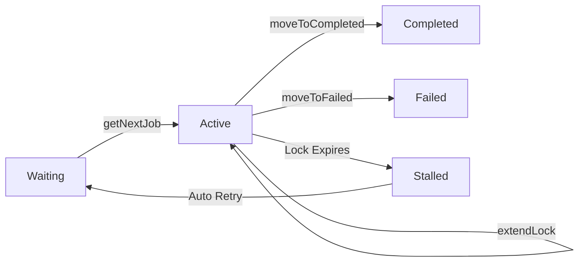

If you want the actual job processing to be done in a separate repo/service than where `bull` is running, this pattern may be for you.

Manually transitioning states for jobs can be done with a few simple methods.

## Implementation Steps

<Steps>
  <Step title="Add job to waiting queue">
    Grab the queue and call `add`
    
    ```typescript
    import Queue from 'bull';
    
    const queue = new Queue({
      limiter: {
        max: 5,
        duration: 5000,
        bounceBack: true // important
      },
      ...queueOptions
    });
    queue.add({ random_attr: 'random_value' });
    ```
  </Step>
  
  <Step title="Pull job from waiting to active">
    ```typescript
    const job: Job = await queue.getNextJob();
    ```
  </Step>
  
  <Step title="Move to failed (if something goes wrong)">
    ```typescript
    const (nextJobData, nextJobId) = await job.moveToFailed(
      {
        message: 'Call to external service failed!',
      },
      true,
    );
    ```
  </Step>
  
  <Step title="Move to completed (on success)">
    ```typescript
    const (nextJobData, nextJobId) = await job.moveToCompleted('succeeded', true);
    ```
  </Step>
  
  <Step title="Return next job if available">
    ```typescript
    if (nextJobdata) {
      return Job.fromJSON(queue, nextJobData, nextJobId);
    }
    ```
  </Step>
</Steps>

## Complete Example

```typescript
import Queue, { Job } from 'bull';

const queue = new Queue('external-processing', {
  limiter: {
    max: 5,
    duration: 5000,
    bounceBack: true
  },
  redis: {
    host: 'localhost',
    port: 6379
  }
});

async function processExternally() {
  while (true) {
    // Fetch next job
    const job = await queue.getNextJob();
    
    if (!job) {
      // No jobs available, wait a bit
      await new Promise(resolve => setTimeout(resolve, 1000));
      continue;
    }
    
    try {
      // Process the job externally
      const result = await externalService.process(job.data);
      
      // Mark as completed
      const (nextJobData, nextJobId) = await job.moveToCompleted(result, true);
      
      // Handle next job if returned
      if (nextJobData) {
        const nextJob = Job.fromJSON(queue, nextJobData, nextJobId);
        // Process nextJob...
      }
    } catch (error) {
      // Mark as failed
      await job.moveToFailed(
        {
          message: error.message,
        },
        true,
      );
    }
  }
}

processExternally();
```

## Lock Duration Management

<Warning>
**Important**: By default, the lock duration for a job returned by `getNextJob()` or `moveToCompleted()` is **30 seconds**.

If processing takes longer, the job will be automatically marked as stalled and, depending on the max stalled options, moved back to the wait state or marked as failed.
</Warning>

### Extending the Lock

To avoid automatic stalling, use `job.extendLock(duration)` to extend the lock before it expires.

```typescript
const job = await queue.getNextJob();

// Start a timer to extend the lock every 15 seconds
const lockExtender = setInterval(async () => {
  await job.extendLock(30000); // Extend by 30 seconds
}, 15000); // Run every 15 seconds (half the lock time)

try {
  // Long-running process
  await externalService.processLongTask(job.data);
  await job.moveToCompleted('success', true);
} finally {
  clearInterval(lockExtender);
}
```

<Tip>
**Recommended**: Extend the lock when **half the lock time has passed** to ensure the lock never expires during processing.
</Tip>

## Configuration

<ParamField path="limiter.bounceBack" type="boolean" default="false">
  **Important**: Set to `true` when manually fetching jobs. This ensures jobs are properly returned to the queue if not processed.
</ParamField>

<ParamField path="limiter.max" type="number">
  Maximum number of jobs to process concurrently
</ParamField>

<ParamField path="limiter.duration" type="number">
  Time window in milliseconds for the rate limiter
</ParamField>

## Use Cases

<CardGroup cols={2}>
  <Card title="Microservices" icon="diagram-project">
    Job creation and processing in different services
  </Card>
  <Card title="External APIs" icon="cloud">
    Processing requires calls to external services
  </Card>
  <Card title="Custom Workflows" icon="flow">
    Need fine-grained control over job state transitions
  </Card>
  <Card title="Language Interop" icon="language">
    Job queue in Node.js, processing in another language
  </Card>
</CardGroup>

## Job State Flow


